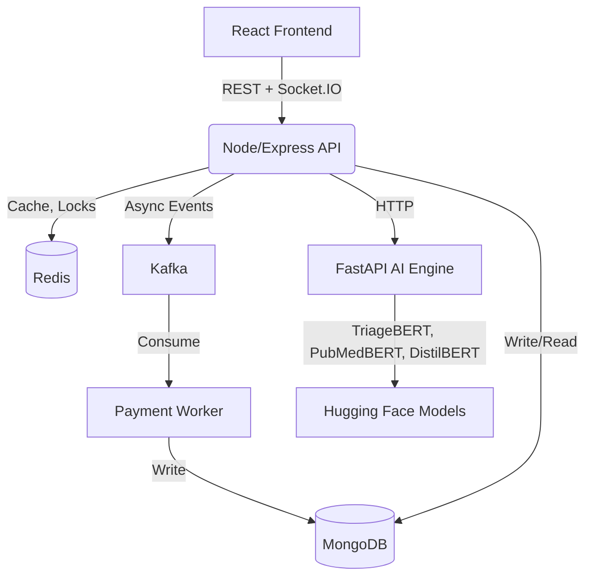

<p align="center">
  
</p>

<h1 align="center" style="font-size: 3rem; font-weight: 800;">MediPulse</h1>

<p align="center">
  <b>A next-generation healthcare SaaS platform combining AI triage, real-time telemedicine, and smart OPD management.</b>
</p>

<p align="center">
  <a href="https://www.medipulse.live/"><b>🌍 Live Demo</b></a> •
  <a href="#-core-features"><b>✨ Features</b></a> •
  <a href="#-tech-stack"><b>🛠️ Tech Stack</b></a> •
  <a href="#-getting-started"><b>🚀 Getting Started</b></a>
</p>

<p align="center">
  
  
  
  
  
</p>

<hr>

## 🌟 What is MediPulse?

MediPulse bridges the gap between **hospitals, doctors, and patients** in one unified ecosystem. It serves as:
- 🧑‍⚕️ **A modern healthcare portal** for patients to find doctors and book appointments.
- 🏥 **An advanced admin suite** for hospitals to manage staff, queues, and OPDs.
- 🤖 **An AI Copilot** for doctors to automate clinical documentation and triage.

By combining hospital management with cutting-edge AI triage and peer-to-peer WebRTC telemedicine, MediPulse dramatically reduces patient wait times and automates clinical workflows.

---

## ✨ Core Features

### 🤖 AI Pre-Triage & Smart Routing (Powered by BERT)
- **Smart Assessment Engine** — Patients describe symptoms in natural language. A dedicated Python FastAPI microservice leverages **Hugging Face Transformers** to run state-of-the-art NLP models concurrently.
- **Severity Prediction (`TriageBERT`)** — Extracts clinical severity (ESI Level 1-5) directly from unstructured symptom text and overrides with deterministic rule-based safety nets for critical emergencies (e.g., "heart attack").
- **Specialty Routing (`PubMedBERT`)** — Maps symptoms to **13 distinct medical specialties** with calibrated confidence scores and differential alternatives, significantly narrowing the search space for doctors.
- **Disease Prediction (`DistilBERT`)** — Predicts exact medical conditions (e.g., Dengue, Migraine) from raw symptom text using a fine-tuned Hugging Face DistilBERT model.
- **Conversational Pre-Consultation** — A Gemini-driven multi-turn triage chat synthesizes conversations into a structured brief: chief complaint, duration, severity, and urgency.

### 🎥 WebRTC Video Consultations & Doctor Copilot
- **Peer-to-Peer Telemedicine** — Direct WebRTC video/audio with no third-party meeting links. Socket.IO handles signalling (offer/answer/ICE) and presence.
- **Robust Audio & Video** — Echo cancellation, noise suppression, and auto-gain control. Graceful degradation: video → audio-only → placeholder canvas track.
- **Live Doctor Copilot** — Streams the consultation transcript in batched chunks, flags drug/symptom red flags against the patient's history, and auto-generates **SOAP notes**.
- **In-Call Chat & Reports Viewer** — Side panels for messaging and reviewing the patient's uploaded reports without leaving the call.

### 🏥 Multi-Tenant Hospitals & Smart OPD
- **Role-Based Access Control (RBAC)** — 7 staff roles including `HOSPITAL_ADMIN`, `DEPARTMENT_HEAD`, `DOCTOR`, `NURSE`, `RECEPTIONIST`, and more.
- **Live OPD Queues** — Atomic per-hospital token sequences, real-time position updates over Socket.IO, and dedicated consoles for doctors and nursing stations.
- **Identity Resolution** — Queues and appointments stay in sync across a doctor's independent practice and their linked hospital-staff profile.

### 💳 Virtual Payment Gateway
- **Concurrency-Safe Ledger** — Redis distributed locks (`SET NX PX`) acquired in **deterministic sorted order** to prevent deadlocks, wrapped in **atomic MongoDB multi-document transactions**.
- **Event-Driven Architecture** — Every payment, refund, wallet update, notification, and appointment booking publishes to **8 Kafka topics** consumed by a separate worker process.

---

## 📊 At a Glance

| Metric | Count | Metric | Count |
|---|---|---|---|
| 🔌 **REST endpoints** | 125 across 18 modules | 🗄️ **Mongoose models** | 24 |
| 🎮 **Express controllers** | 20 | ⚙️ **Backend services** | 9 |
| ⚡ **Socket.IO events** | 15 | ⚛️ **React components** | 46 (35 client routes) |
| 📨 **Kafka topics** | 8 | 🧠 **Deep Learning Models** | 3 (TriageBERT, PubMedBERT, DistilBERT) |
| 🛡️ **Staff Roles (RBAC)** | 7 | 🐍 **Python Microservices** | 1 (FastAPI Engine) |

---

## 🧩 Architecture

Heavy ML work is decoupled from the Node event loop into standalone FastAPI services. The backend calls them over HTTP with defensive error handling and Docker-network fallback routing, degrading gracefully when a service is unreachable.



### 🛡️ Layered Fallback Strategy
The AI prediction is intentionally layered so one failure never leaves a doctor with an empty panel:
1. **ML Microservice** (Primary — High accuracy NLP)
2. **Deterministic Rules** (Flags critical keywords natively in Node/Python for immediate triage overrides)
3. **Reported Chief Complaint** (Final fallback — surfaces what the patient actually said instead of a bare "Unknown")

---

## 🛠️ Tech Stack

| Layer | Technologies |
|---|---|
| **🎨 Frontend** | React, Vite, React Router, Tailwind CSS v4, Axios, Lucide, jsPDF |
| **⚙️ Backend** | Node.js, Express, JWT, Google OAuth, Nodemailer |
| **🗄️ Database** | MongoDB + Mongoose (multi-document transactions) |
| **⚡ Cache & Locks**| Redis (state caching, distributed locks, TTL keys) |
| **📨 Messaging** | Apache Kafka (KafkaJS) — 8 topics, producer + consumer worker |
| **📞 Real-time** | Socket.IO (queues, presence, signalling), WebRTC (media) |
| **🧠 AI / ML** | Google Gemini, Python, FastAPI, Hugging Face Transformers (`TriageBERT`, `PubMedBERT`, `DistilBERT`), PyTorch, LightGBM |
| **☁️ DevOps** | Docker, Docker Compose, Render, Vercel |

---

## 🚀 Getting Started

### Option 1: Docker (Recommended)
Run the full stack (Mongo, Redis, Kafka, API, consumer, frontend) with one command:
```bash
docker compose up --build
```

### Option 2: Manual Setup
```bash
# 1. Start the Backend
cd backend
npm install
npm run dev

# 2. Start the Frontend
cd frontend
npm install
npm run dev

# 3. Start the ML Service (Downloads ~860MB of BERT weights on first run)
cd medipulse-ranking-engine
pip install -r requirements.txt
uvicorn app.main:app --port 8000 --reload
```

> **Note**: Copy `.env.example` to `.env` and fill in your credentials (`DATABASE_URL`, `TOKEN_KEY`, `GEMINI_API_KEY`, `REDIS_URL`, `KAFKA_BROKERS`, `GOOGLE_CLIENT_ID`, and `ML_MICROSERVICE_URL`).

---

## 🛣️ Roadmap

- ✅ **Phase 1** — Multi-tenant models, OPD tokens, WebRTC consults, virtual wallet.
- ✅ **Phase 2** — AI triage, TriageBERT integration, SOAP copilot, Kafka payment events.
- 🚧 **Phase 3 (Next)** — Lab orders, report uploads, QR-verified digital prescriptions, family record manager.
- ⏳ **Phase 4** — Swap the heuristic ranking stub with trained LightGBM LambdaMART models using live interaction data; wait-time prediction.
- ⏳ **Phase 5** — ABHA (Ayushman Bharat Health Account) integration, enterprise API access, mobile rollout.

---

<p align="center">
  Made with ❤️ by the MediPulse Team
</p>
